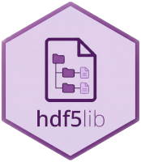

<div style="text-align:center">

</div>

The HDF5 hierarchical storage format is the industry standard for managing massive, complex datasets in **genomics**, **environmental science**, and **quantitative finance**. It serves as the data backbone for everything from NASA’s Earth-observing missions to next-generation sequencing. Since these are the exact domains where R is the primary language for analysis, the lack of reliable HDF5 support on CRAN has been a significant bottleneck. For years, developers have been trapped in a "dependency minefield," forced to choose between heavy Bioconductor requirements or brittle system configurations that frequently fail during installation.

We are excited to announce [**h5lite**](https://cran.r-project.org/package=h5lite) and [**hdf5lib**](https://cran.r-project.org/package=hdf5lib), now available on CRAN. These packages provide a zero-dependency interface to HDF5 2.0, finally bringing world-class hierarchical storage to the R ecosystem in a way that is suitable for both interactive analysis and redistributable R package development.


## What is HDF5? The "Supercharged R List" Analogy

If you aren't familiar with HDF5, the easiest way to think about it is as a **persistent, cross-platform R `list`**. In R, a `list` is powerful because it can hold a matrix of numbers, a data frame, and a nested list all in one object. HDF5 brings this same flexibility to your hard drive, allowing you to:

* **Store Heterogeneous Data Together:** Keep arrays, tidy data frames, and raw bytes inside a single `.h5` file.

* **Perform Efficient Partial I/O:** HDF5 allows you to "reach in" and read only the specific slice of a dataset you need. This makes it possible to work with multi-gigabyte objects that would otherwise crash your R session.

* **Preserve Metadata with Attributes:** HDF5 attributes are the direct analog to R attributes. You can attach custom metadata - like units, timestamps, or descriptions - directly to any dataset or group.

* **Organize with Groups:** Just as you nest lists in R, HDF5 uses a filesystem-like hierarchy of "groups" to organize your data.

* **Share Across Languages:** Because HDF5 is a universal standard, that "list" you saved in R can be opened in Python as a dictionary or in Julia as a named tuple, with all your attributes and dimensions intact.


## The Motivation: Navigating the Dependency Minefield

The primary goal of `h5lite` and `hdf5lib` is to eliminate the "Dependency Minefield" that R users often face. Historically, existing HDF5 interfaces in R presented significant hurdles for anyone trying to build a stable, redistributable package:

* **The Bioconductor Barrier:** Relying on the `rhdf5` ecosystem requires your users to navigate `BiocManager`, which complicates the standard `install.packages()` workflow and can cause issues on CRAN check farms.

* **System Library Fragility:** The `hdf5r` package typically requires users to manually install `libhdf5-dev` on their OS. This is notoriously difficult for Windows users and creates an unpredictable environment where your package might fail if the user has a mismatched library version.

By providing a **guaranteed, zero-dependency environment**, these packages allow R developers to simply add `LinkingTo: hdf5lib` to their `DESCRIPTION` file. For the first time, you can ship a package that uses HDF5 and be certain it will "just work" for every user, on every platform, immediately upon installation.


## Choosing Your Path: Which Package to Use?
    
Depending on whether you are analyzing data or building tools for others, your entry point into this ecosystem will differ:

* **Interactive Users:** You only need **`h5lite`**. It provides a simplified R interface (`h5_read`, `h5_write`) to quickly store and retrieve data, removing the need to manage complex HDF5 objects or system dependencies.

* **Package Developers:** You have two powerful ways to leverage this infrastructure:
    * **`Imports: h5lite`**: Use this to call the streamlined R interface within your own package functions.
    * **`LinkingTo: hdf5lib`**: Use this if your package contains C or C++ code and requires direct, high-performance access to the native HDF5 C API.


## The Interface: [`h5lite`](https://cmmr.github.io/h5lite/)

`h5lite` is an opinionated, streamlined interface that handles the complexities of [type mapping and interoperability](https://cmmr.github.io/h5lite/articles/data-types.html) so you can focus on your data. Below is a summary of the type translation logic handled by the h5lite interface:

| R Data Type    | HDF5 Equivalent  | Description                                    |
| :------------- | :--------------- | :--------------------------------------------- |
| **Numeric**    | *variable*       | Selects optimal type: `uint8`, `float32`, etc. |
| **Logical**    | `uint8`          | Stored as 0 (FALSE) or 1 (TRUE).               |
| **Character**  | `string`         | Variable or fixed-length; UTF-8 or ASCII.      |
| **Complex**    | `complex`        | Native HDF5 2.0+ complex numbers.              |
| **Raw**        | `opaque`         | Raw bytes / binary data.                       |
| **Factor**     | `enum`           | Integer indices with label mapping.            |
| **integer64**  | `int64`          | 64-bit signed integers via `bit64` package.    |
| **POSIXt**     | `string`         | ISO 8601 string (`YYYY-MM-DDTHH:MM:SSZ`).      |
| **List**       | `group`          | Recursive container structure.                 |
| **Data Frame** | `compound`       | Table of mixed types.                          |
| **NULL**       | `null`           | Creates a placeholder.                         |

### Key Features

* **Smart Defaults:** The package automatically chooses efficient storage types, such as `int8` for small integers or `float64` for vectors containing `NA` values.

* **Precision Control:** Use the `as` argument to explicitly request types like `bfloat16`, `float32`, or specific fixed-length strings to match external schemas.

* **Transparent Interoperability:** R uses column-major order while HDF5 uses row-major. `h5lite` handles these permutations automatically, ensuring your data opens correctly in Python or Julia.

* **Metadata Preservation:** R `names`, `row.names`, and `dimnames` are preserved as HDF5 dimension scales, maintaining your metadata across platforms.

* **Advanced Compression:** Supports both [GZIP and SZIP compression](https://cmmr.github.io/h5lite/articles/data-compression.html). SZIP is an extremely fast, specialized algorithm designed specifically for high-performance scientific data.

* **Efficient Partial Reading:** One of HDF5's greatest strengths is the ability to read small slices of massive datasets without loading the entire file into memory. `h5lite` now provides ["smart" partial I/O](https://cmmr.github.io/h5lite/articles/partial-reading.html) via `start` and `count` parameters, which automatically target the most logical structural units (like rows in a matrix or elements in a vector).




## The Engine: [`hdf5lib`](https://cmmr.github.io/hdf5lib/)

Under the hood, `h5lite` is powered by **`hdf5lib`**. While most users won't interact with it directly, it serves as the rock-solid foundation for the entire ecosystem.

* **Bundled Source:** To eliminate external dependencies, `hdf5lib` bundles the complete HDF5 2.0.0 source code. It compiles natively during installation on macOS, Windows, and Linux - no external system libraries required.

**Bundled Gzip and Szip Support:** To ensure zero external dependencies, `hdf5lib` bundles both the **zlib** and **libaec** libraries. These libraries are permissively licensed and handle a broad range of compression needs out-of-the-box on all platforms.

* **Thread-Safety:** Unlike many system builds, `hdf5lib` is compiled with thread-safety enabled by default. This allows for [safe parallel I/O](https://cmmr.github.io/hdf5lib/articles/parallelism.html) regardless of your chosen threading system.

* **Versioning & API Stability:** Developers can specify `LinkingTo: hdf5lib (>= 2.0)` to ensure HDF5 2.0 features are available. Built-in [API versioning](https://cmmr.github.io/hdf5lib/articles/api-versioning.html) also safeguards your code against breaking changes in future HDF5 releases.


## Stability and Minimal Footprint

Reliability is paramount for a storage interface. Both packages minimize their dependency footprint by **not importing any other R packages**. To ensure a stable experience, `h5lite` maintains a **100% code coverage test suite**. Both packages have been rigorously validated across standard CRAN platforms (Linux, Windows, macOS) and compilers (GCC, Clang).


## Comparison at a Glance

| Feature              | h5lite / hdf5lib       | rhdf5 / Rhdf5lib   | hdf5r           |
| :------------------- | :--------------------- | :----------------- | :-------------- |
| **Repository**       | **CRAN**               | Bioconductor       | CRAN            |
| **HDF5 Version**     | **2.0.0 (Guaranteed)** | 1.10.7 (or System) | System          |
| **API Philosophy**   | **Streamlined**        | Comprehensive      | Comprehensive   |
| **Partial I/O**      | **Yes (Smart/Simple)** | Yes (Low-level)    | Yes (Low-level) |
| **Install Friction** | **None**               | BiocManager        | System Libs     |
| **Thread Safety**    | **Yes (Default)**      | No (Default)       | Varies          |


## Try It Out

```r
install.packages("h5lite")

library(h5lite)
file <- tempfile(fileext = ".h5")

# Write various R objects with smart defaults
h5_write(1:10, file, "ints")                   # Integer Vector
h5_write(I("example"), file, "/", attr = "id") # Scalar Attribute
h5_write(matrix(1:20, nrow = 5), file, "mtx")  # Numeric Matrix
h5_write(factor(letters), file, "letters")     # Factor -> ENUM
h5_write(list(a = 1, b = 2), file, "config")   # List -> GROUP
h5_write(iris, file, "flowers/iris")           # Data Frame -> COMPOUND

# Write with specific type coercions
h5_write(iris, file, "flowers/coerced",
  as = c(Sepal.Length = "bfloat16", .numeric = "float32"))

# Inspect the file structure
h5_str(file)
#> /
#> ├── @id <utf8[7] scalar>
#> ├── mtx <uint8 × 5 × 4>
#> ├── letters <enum × 26>
#> ├── config/
#> │   ├── a <uint8 × 1>
#> │   └── b <uint8 × 1>
#> ├── ints <uint8 × 10>
#> └── flowers/
#>     ├── iris <compound[5] × 150>
#>     │   ├── $Sepal.Length <float64>
#>     │   ├── $Sepal.Width <float64>
#>     │   ├── $Petal.Length <float64>
#>     │   ├── $Petal.Width <float64>
#>     │   └── $Species <enum>
#>     └── coerced <compound[5] × 150>
#>         ├── $Sepal.Length <bfloat16>
#>         ├── $Sepal.Width <float32>
#>         ├── $Petal.Length <float32>
#>         ├── $Petal.Width <float32>
#>         └── $Species <enum>
```

For a deeper dive, explore the [Getting Started with h5lite](https://cmmr.github.io/h5lite/articles/h5lite.html) guide and the [hdf5lib documentation](https://cmmr.github.io/hdf5lib/).
